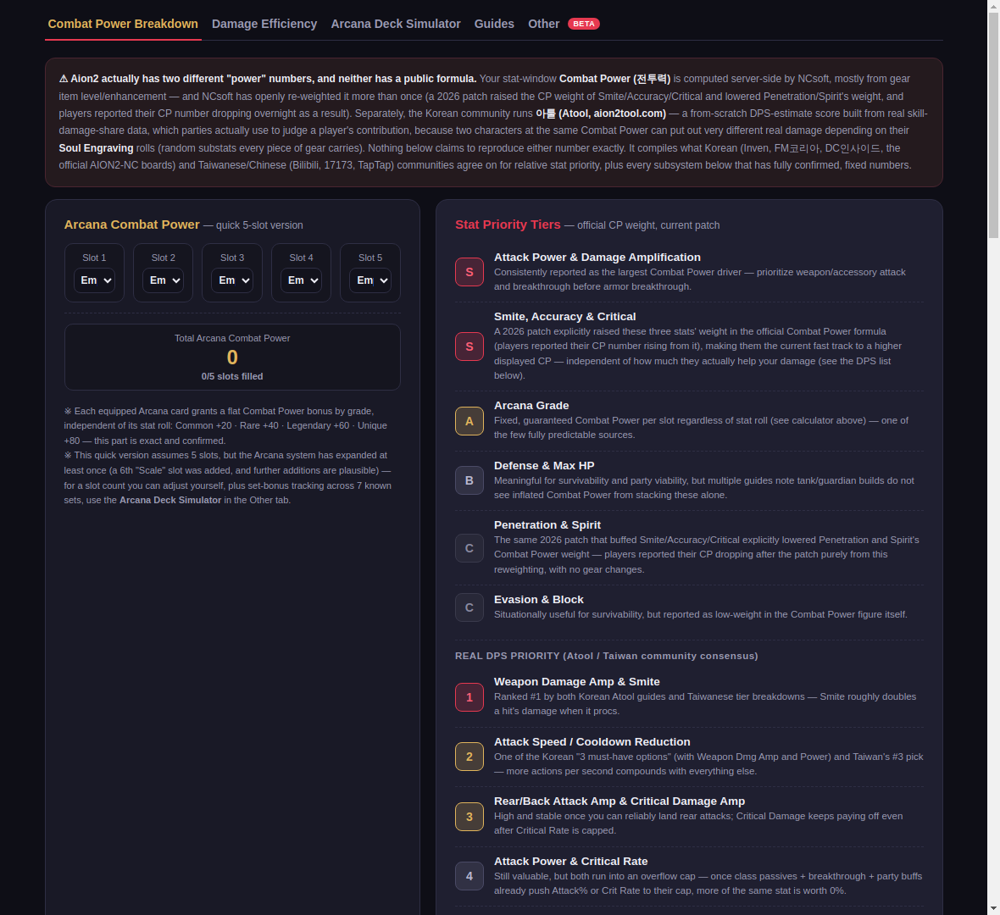
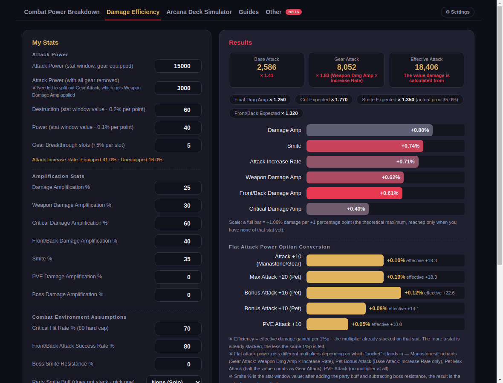
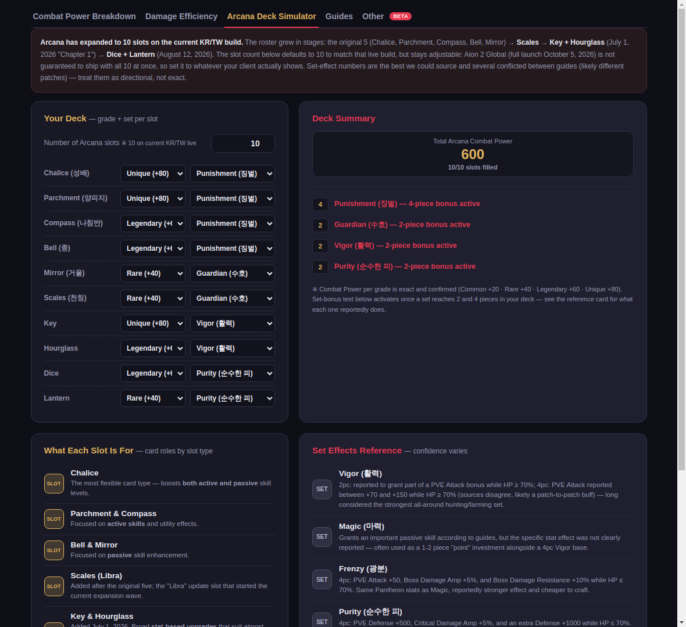
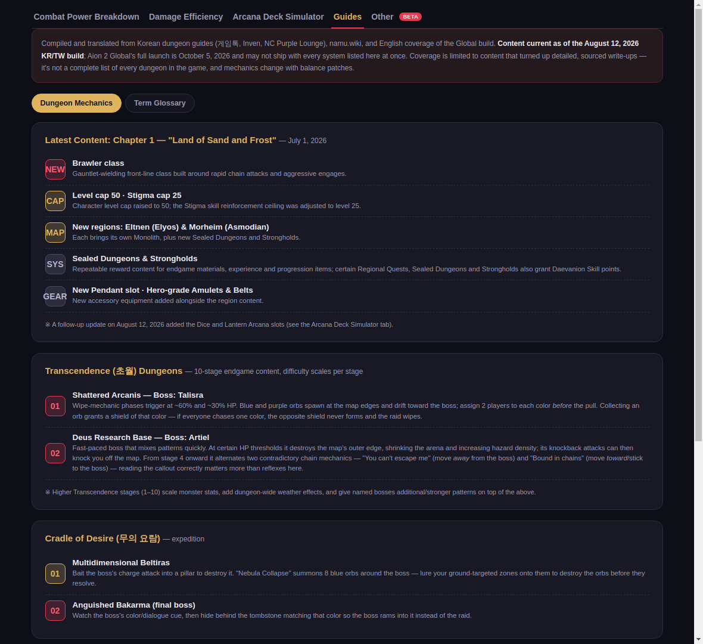
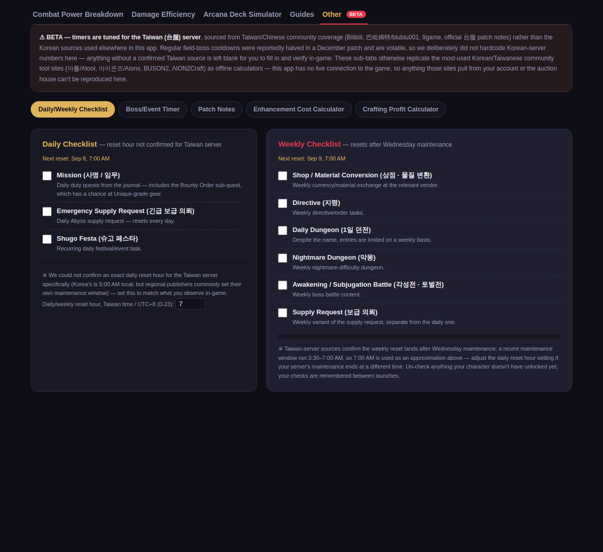
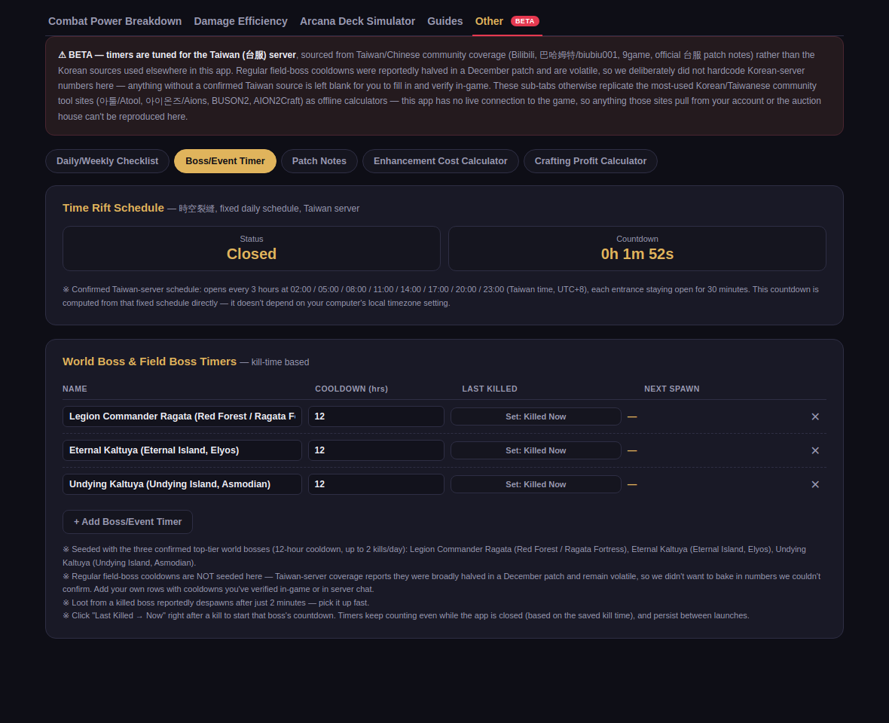
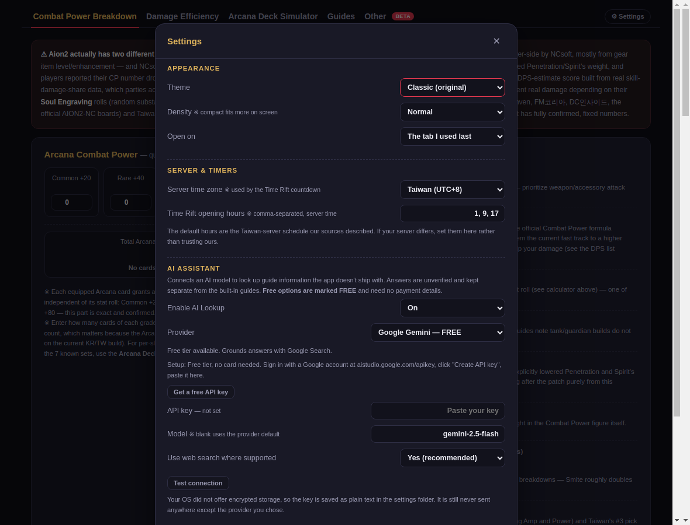
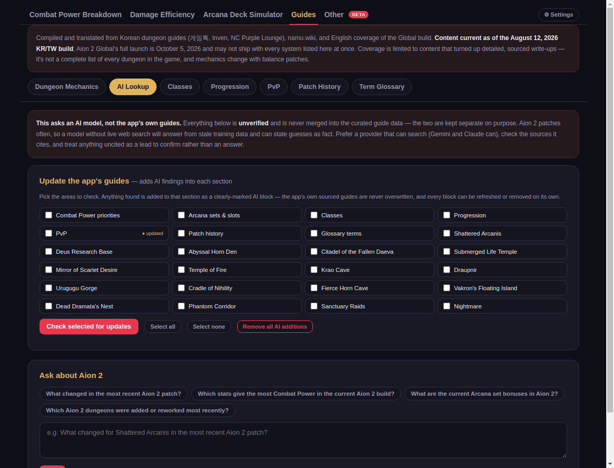
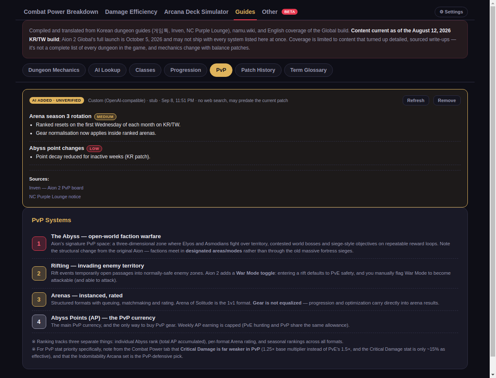

# Aion 2 Companion

An English-language Electron desktop toolkit for Aion2, built around a
translated port of StepTube's Korean stat-efficiency calculator (originally
at https://kjymm2.github.io/aion2damage/) plus original tools compiled from
Korean and Taiwanese community research.

**[⬇ Download the latest Windows build](../../releases/latest)** — portable
`.exe`, no installer needed.

## Features

### Combat Power Breakdown
Aion2 has two different "power" numbers — the official, server-computed
Combat Power, and 아툴/Atool, a community DPS-estimate score — and they can
diverge. This tab compiles what's actually confirmed: exact Arcana grade
values, an Attribute/Pantheon planner, Independent Proc mechanics (Smite,
Perfect, Multi-Hit), Accuracy/Hit mechanics with a live calculator, Soul
Engraving priority by gear slot, and Pet Understanding priority — plus two
stat-priority lists that deliberately disagree (official CP weight vs. real
DPS impact) and say why.



### Damage Efficiency
The original calculator, fully translated: enter your stats to see the real
damage increase from raising each stat by 1 percentage point, which flat
attack-power sources are worth the most, and a Manastone/Gear option
simulator that recomputes your exact total damage change.

Bars use a fixed scale — a full bar is +1.00% damage per +1 percentage
point, which is the mathematical ceiling for every stat on the chart — so
bar lengths mean the same thing between builds and across sessions.



### Arcana Deck Simulator
Plan an Arcana loadout without guessing at a slot count the game itself
keeps changing — set it yourself (1–12) and the deck summary tracks Combat
Power plus which of the 7 known sets have hit their 2-piece/4-piece bonus
threshold, backed by a sourced set-effects reference.



### Guides
A searchable index of 17 instances across Transcendence, Expedition, Raid
and Solo — filter by category or search any dungeon, boss or mechanic
("orb", "Kromede", "wipe") and expand the one you need, with original
diagrams for the mechanics that are easier to see than to read. Entries
where no reliable write-up could be found are marked and say so, rather
than carrying invented mechanics. Alongside it: Classes, Progression, PvP,
Patch History, and a Korean/Chinese ↔ English term glossary for everything
in the app that has no official English name yet.



### Other
Daily/weekly quest checklist with real reset timing, a Field/World Boss and
Time Rift event timer, a best-effort Patch Notes fetcher with guaranteed
fallback links to official sources, and general-purpose Enhancement Cost
and Crafting Profit calculators.




### Settings
Four themes — **Classic** (the original palette, and still the default),
**Dark** (a more neutral dark), **Light**, and **Match system**. Plus a
compact density mode, a choice of which tab the app opens on, and a
configurable time zone and schedule for the Time Rift countdown.



Everything you type is saved locally between sessions — stat inputs, Arcana
deck, checklist progress, timers and calculator rows — and "Reset saved
data" clears it. Ctrl/Cmd+1–5 switch tabs; Ctrl/Cmd+F jumps straight to
dungeon search.

### AI Assistant — optional, bring your own model
Connect an AI model to research information the app doesn't ship with. It's
off by default and entirely opt-in.

**Ask about Aion 2** answers one-off questions. **Update the app's guides**
goes further: pick from 24 areas — the seven guide sections plus every
instance in the dungeon index — and the model researches each one and adds
what it finds to that section.



Findings appear as a marked block inside the relevant section, showing the
provider, model, fetch time, a confidence rating per entry, and the sources
cited. Each block can be refreshed or removed on its own, and one control
removes them all.



Seven providers, four of them free:

| Provider | Free | Web search | Needs a key |
|---|---|---|---|
| Google Gemini | yes | yes (Google Search grounding) | yes |
| OpenRouter | yes | yes (`:online` models) | yes |
| Groq | yes | no | yes |
| Ollama (runs locally) | yes | no | **no** |
| Anthropic (Claude) | no | yes | yes |
| OpenAI | no | no | yes |
| Any OpenAI-compatible endpoint | — | — | optional |

Ollama is the only option needing no account at all — the app can detect a
local server, list your installed models and fill the field in. The others
need a free account and key; none of them offer a keyless endpoint, and the
app links straight to each provider's key page with the exact steps.

Your key is held by the app's main process, encrypted with your operating
system's secure storage where one is available, and is never exposed to the
app's own page — the UI only ever sees whether a key is set and a masked
hint of it. Requests go only to the provider you picked.

## Honesty by design

Aion2 has no public API and most of its systems (Combat Power's real
formula, current Arcana slot count, exact enhancement success rates) are
either undocumented or actively changing between patches. Rather than
present guessed numbers as fact, this app is explicit throughout about
what's confirmed vs. directional, cites its Korean/Taiwanese community
sources, and gives you inputs to fill in with your own in-game values where
no reliable number exists.

The AI features follow the same rule and are deliberately kept as a
**separate layer**. The app's own researched guides are the base and are
never modified; AI findings are stored apart, always labelled unverified,
and always reversible — so you can tell at a glance which is which, and
undo anything that turns out to be wrong. A model without live web search
is answering from training data that predates the current patch, and the
app says so on every block it produces.

## Run in development

```bash
npm install
npm start
```

## Build a distributable

```bash
npm install
npm run dist
```

This uses `electron-builder` to produce a platform-native package (`.dmg` on
macOS, `.exe`/NSIS installer or portable on Windows, `.AppImage` on Linux)
under `release/`.

## License

**Public domain — no rights reserved** ([Unlicense](LICENSE)). Copy it, fork
it, modify it, ship it, sell it; no attribution required.

That dedication covers the code in this repository only. AION and AION 2,
and all in-game names, terminology and systems referenced by this tool, are
property of NCSOFT Corporation — this is an unofficial, non-commercial fan
tool with no affiliation with or endorsement by NCSOFT. The damage model in
the Damage Efficiency tab is an English translation of a calculator
originally published by [StepTube](https://kjymm2.github.io/aion2damage/),
and guide content is compiled from community sources cited in-app.
